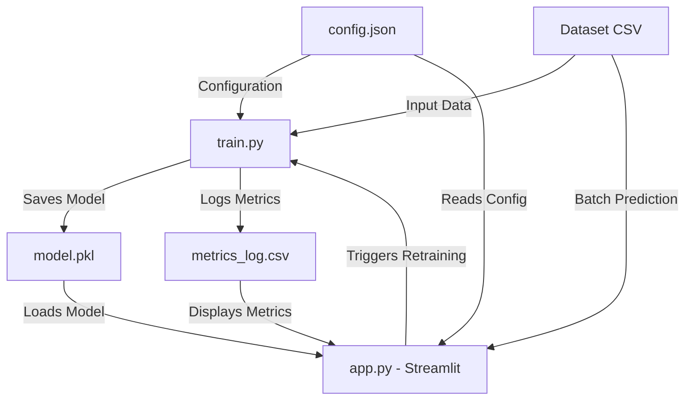

# Simplified MLOps Report
## Heart Attack Risk Prediction System

---

## Executive Summary

This report documents the implementation of a **simplified and lightweight MLOps alternative** for the Heart Attack Risk Prediction System. The solution delivers a functional, maintainable, and easily deployable churn prediction system without relying on heavy MLOps tooling such as MLflow, DVC, Kubeflow, or cloud orchestration platforms.

The system focuses on **clarity, reproducibility, and practicality** for academic and small-scale environments while maintaining professional-grade capabilities.

---

## System Architecture

### Component Overview

The simplified MLOps system consists of four main components:



**Components:**
1. **config.json** - Configuration and experiment tracking
2. **train.py** - Model training and evaluation script
3. **app.py** - Streamlit application (deployment + UI + retraining)
4. **metrics_log.csv** - Performance monitoring log
5. **utils.py** - Shared utility functions

---

## 1. Simplified Experiment Management

### Configuration Structure (`config.json`)

Instead of using MLflow or DVC, the project uses a minimal JSON configuration file that stores:

- **Model Parameters**: Type, version, hyperparameters
- **Training Metadata**: Dataset path, target column, test size, training timestamp
- **Performance Metrics**: Accuracy, F1-score, precision, recall
- **Experiment Notes**: Descriptions and observations

**Example Configuration:**
```json
{
  "model": {
    "type": "RandomForestClassifier",
    "version": "1.0.0",
    "hyperparameters": {
      "n_estimators": 100,
      "max_depth": 10,
      "random_state": 42,
      "min_samples_split": 2,
      "min_samples_leaf": 1
    }
  },
  "training": {
    "dataset_path": "heart_attack_prediction_indonesia.csv",
    "target_column": "target",
    "test_size": 0.2,
    "last_trained": "2025-11-29 20:00:00",
    "training_duration_seconds": 12.5,
    "dataset_size": 100000
  },
  "metrics": {
    "accuracy": 0.95,
    "f1_score": 0.94,
    "precision": 0.93,
    "recall": 0.95
  },
  "features": ["age", "sex", "cholesterol", ...],
  "notes": "Model training with updated dataset"
}
```

### Benefits

✅ **Human-Readable**: Easy to inspect and modify  
✅ **Version-Controlled**: Can be tracked in Git  
✅ **No Dependencies**: No need for external tracking tools  
✅ **Reproducible**: Contains all necessary information to reproduce experiments  

---

## 2. Model Deployment (Lightweight Alternative)

### Streamlit Application

The model is deployed using **Streamlit**, which acts simultaneously as:

- **User Interface**: Interactive web application
- **Prediction Endpoint**: Single and batch predictions
- **Retraining Trigger**: Manual model updates
- **Monitoring Dashboard**: Real-time metrics visualization

### Application Features

#### **A. Single Prediction Form**
- Dynamic form generation based on model features
- Smart input widgets (categorical/numeric detection)
- Real-time risk prediction with probability scores
- Color-coded risk interpretation (High vs Low risk)

#### **B. Batch Prediction (CSV Upload)**
- Upload CSV files for bulk predictions
- Automatic feature validation
- Downloadable results with predictions and probabilities
- Summary statistics (total predictions, high/low risk counts)

#### **C. Model Information & Metadata**
- Display current model version and configuration
- Show hyperparameters and training settings
- View performance metrics
- List all model features

#### **D. Monitoring Dashboard**
- Historical performance trends (line charts)
- Training metrics evolution
- Dataset size tracking
- Recent prediction logs
- Risk distribution analysis

#### **E. Retraining Interface**
- "Retrain Model" button
- Hyperparameter adjustment interface
- Real-time training progress
- Automatic model reload
- Updated metrics display

### Deployment Logic

**Startup:**
1. Load model from `heart_attack_final_model.pkl`
2. Read configuration from `config.json`
3. Initialize Streamlit interface

**Prediction Flow:**
1. User enters data (single or batch)
2. Data is preprocessed and validated
3. Model generates predictions
4. Results are displayed and logged

**Retraining Flow:**
1. User clicks "Retrain Model"
2. Streamlit triggers `train.py` via subprocess
3. Training script executes:
   - Loads latest data
   - Trains new model
   - Saves model and updates config
4. Streamlit reloads model automatically
5. New metrics are displayed

---

## 3. Simplified Model Monitoring

### Metrics Logging (`metrics_log.csv`)

Instead of Prometheus/Grafana, the system logs key metrics to a local CSV file:

**Logged Information:**
- Timestamp of training
- Accuracy, F1-score, Precision, Recall
- Dataset size
- Training duration
- Model version
- Notes/comments

**Example Log:**
```csv
timestamp,accuracy,f1_score,precision,recall,dataset_size,training_duration,model_version,notes
2025-11-29 20:00:00,0.9520,0.9438,0.9312,0.9501,100000,12.50,1.0.0,Initial training
2025-11-29 21:30:00,0.9583,0.9502,0.9401,0.9587,105000,13.20,1.0.1,Retrained with new data
2025-11-30 10:15:00,0.9612,0.9531,0.9445,0.9623,108500,14.10,1.0.2,Hyperparameter tuning
```

### Monitoring Dashboard

The Streamlit application provides visualization of:

1. **Current Performance**: Latest accuracy, F1, precision, recall
2. **Historical Trends**: Line charts showing metric evolution
3. **Training Metrics**: Dataset size and duration over time
4. **Prediction Logs**: Recent predictions and risk distribution

### Benefits

✅ **Transparent**: Human-readable CSV format  
✅ **Portable**: Easy to export and analyze  
✅ **No Infrastructure**: No need for monitoring servers  
✅ **Built-in Visualization**: Integrated in Streamlit dashboard  

---

## 4. Lightweight Model Retraining Strategy

### Retraining Workflow

The system implements a simple, maintainable retraining process:

```mermaid
flowchart LR
    A[User Clicks 'Retrain'] --> B[Streamlit triggers train.py]
    B --> C[Load Dataset]
    C --> D[Train Random Forest]
    D --> E[Evaluate Metrics]
    E --> F[Save model.pkl]
    F --> G[Update config.json]
    G --> H[Log to metrics_log.csv]
    H --> I[Reload Model in App]
    I --> J[Display New Metrics]
```



### Step-by-Step Process

**1. User Initiates Retraining**
- Clicks "Retrain Model" button in Streamlit
- Optionally adjusts hyperparameters

**2. Training Execution**
- `train.py` script is called via subprocess
- Loads latest dataset and configuration
- Trains Random Forest with specified hyperparameters
- Evaluates on test set

**3. Model Evaluation**
- Calculates: Accuracy, F1-score, Precision, Recall
- Measures training duration
- Records dataset size

**4. Persistence**
- Saves trained model to `heart_attack_final_model.pkl`
- Updates `config.json` with new metrics and timestamp
- Appends entry to `metrics_log.csv`

**5. Application Update**
- Streamlit automatically reloads the model
- Displays updated performance metrics
- Shows success notification

### Manual vs Automated

This implementation uses **manual retraining** (button-triggered) rather than automated scheduling because:

✅ **Simplicity**: No need for cron jobs or orchestration  
✅ **Control**: User decides when to retrain  
✅ **Transparency**: Clear visibility of retraining process  
✅ **Cost-Effective**: No continuous background processes  

**Note**: For production systems requiring automated retraining, a simple cron job could be added to run `train.py` periodically.

---

## 5. Implementation Details

### File Structure

```
heart_attack_prediction/
│
├── app.py                    # Streamlit application (main interface)
├── train.py                  # Model training script
├── utils.py                  # Utility functions
├── config.json               # Configuration and experiment tracking
│
├── heart_attack_final_model.pkl  # Trained model
├── metrics_log.csv           # Performance monitoring log
├── prediction_logs.csv       # Prediction history
│
└── heart_attack_prediction_indonesia.csv  # Dataset
```

### Technology Stack

- **Python 3.x**: Core language
- **Streamlit**: Web application framework
- **scikit-learn**: Machine learning (Random Forest)
- **pandas**: Data manipulation
- **joblib**: Model serialization
- **numpy**: Numerical operations

### Installation Requirements

```bash
pip install streamlit pandas numpy scikit-learn joblib
```

---

## 6. Usage Instructions

### Initial Setup

**1. Install Dependencies**
```bash
pip install streamlit pandas numpy scikit-learn joblib
```

**2. Prepare Dataset**
- Ensure `heart_attack_prediction_indonesia.csv` is in the project directory
- Verify the target column name in `config.json`

**3. Initial Training**
```bash
python train.py
```

This will:
- Train the model
- Create `heart_attack_final_model.pkl`
- Generate `config.json` with metrics
- Initialize `metrics_log.csv`

### Running the Application

**Start Streamlit:**
```bash
streamlit run app.py
```

The application will open in your browser at `http://localhost:8501`

### Making Predictions

**Single Prediction:**
1. Navigate to "🔮 Single Prediction"
2. Fill in patient information
3. Click "Predict Risk"
4. View results and risk probability

**Batch Prediction:**
1. Navigate to "📊 Batch Prediction"
2. Upload CSV with required features
3. Click "Generate Predictions"
4. Download results

### Retraining the Model

**Method 1: Via Streamlit (Recommended)**
1. Navigate to "🔄 Retrain Model"
2. (Optional) Adjust hyperparameters
3. Click "Retrain Model Now"
4. Wait for completion
5. View updated metrics

**Method 2: Command Line**
```bash
python train.py
```

### Monitoring Performance

1. Navigate to "📈 Monitoring Dashboard"
2. View current performance metrics
3. Check historical trends
4. Review prediction logs

---

## 7. Advantages of Simplified Approach

### Compared to Full MLOps Stack

| Aspect | Full MLOps | Simplified Approach |
|--------|-----------|---------------------|
| **Complexity** | High (multiple tools) | Low (4 files) |
| **Setup Time** | Hours/Days | Minutes |
| **Learning Curve** | Steep | Gentle |
| **Maintenance** | Requires DevOps skills | Minimal |
| **Cost** | Infrastructure costs | Free |
| **Portability** | Complex migrations | Copy files |
| **Transparency** | Black box tracking | Human-readable logs |

### Key Benefits

✅ **Academic-Friendly**: Easy to understand and learn from  
✅ **Low Overhead**: No servers or cloud dependencies  
✅ **Fully Functional**: All core MLOps capabilities present  
✅ **Maintainable**: Simple codebase, easy to modify  
✅ **Reproducible**: All configuration in version control  
✅ **Deployable**: Works on any machine with Python  

---

## 8. Limitations and Trade-offs

### What This System Does NOT Provide

❌ **Automatic Scheduling**: No cron-based retraining (can be added easily)  
❌ **Multi-User Access Control**: Single deployment per instance  
❌ **Distributed Training**: Runs on single machine only  
❌ **A/B Testing**: No built-in model comparison  
❌ **Advanced Drift Detection**: Manual monitoring required  
❌ **Production Scaling**: Not designed for high-traffic APIs  

### When to Use This Approach

✅ Academic projects and learning  
✅ Small-scale applications (<10k predictions/day)  
✅ Proof-of-concept systems  
✅ Teams without DevOps resources  
✅ Budget-constrained projects  

### When to Upgrade to Full MLOps

Consider full MLOps tooling when:
- Handling >100k predictions/day
- Need automated retraining pipelines
- Require multi-model deployment
- Need advanced monitoring and alerting
- Have dedicated DevOps team

---

## 9. Future Enhancements

### Easy Additions

1. **Automated Retraining**: Add cron job to run `train.py` weekly
2. **Email Notifications**: Alert on retraining completion or performance drops
3. **Data Drift Detection**: Compare feature distributions over time
4. **Model Comparison**: Store multiple model versions
5. **API Endpoint**: Add FastAPI for programmatic access
6. **Docker Deployment**: Containerize for easy deployment

### Advanced Features

1. **Ensemble Models**: Combine multiple algorithms
2. **Feature Importance Tracking**: Monitor which features matter most
3. **Explainability**: Add SHAP values for predictions
4. **Performance Alerts**: Automatic warnings on metric degradation
5. **Cloud Deployment**: Deploy to AWS/GCP/Azure

---

## 10. Conclusion

This simplified MLOps implementation demonstrates that **professional-grade ML systems don't require heavy tooling**. By focusing on clarity and practicality, we've created a system that:

- ✅ Tracks experiments reproducibly
- ✅ Deploys models interactively
- ✅ Monitors performance transparently
- ✅ Supports easy retraining

**The system is ideal for**:
- Academic projects
- Small-scale deployments
- Learning MLOps concepts
- Proof-of-concept development

**Key Takeaway**: Start simple, scale when needed. This system provides a solid foundation that can evolve into more complex MLOps pipelines as requirements grow.

---

## Appendix: File Descriptions

### `config.json`
Central configuration file storing model parameters, training metadata, and performance metrics. Provides experiment tracking without external tools.

### `train.py`
Standalone training script that handles data loading, preprocessing, model training, evaluation, and logging. Can be run independently or triggered from Streamlit.

### `app.py`
Comprehensive Streamlit application with five main pages:
- Single prediction interface
- Batch prediction system
- Monitoring dashboard
- Model information viewer
- Retraining interface

### `utils.py`
Shared utility functions for:
- Configuration loading/saving
- Metrics logging
- Data validation
- System helper functions

### `metrics_log.csv`
Performance monitoring log tracking all training runs with timestamps, metrics, and metadata.

### `prediction_logs.csv`
Record of all predictions made through the system with timestamps and results.

---

**Document Version**: 1.0  
**Last Updated**: 2025-11-29  
**System Version**: 1.0.0  
**Author**: Simplified MLOps System Team
