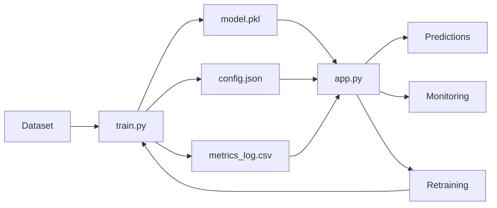

# 🏥 Heart Attack Risk Prediction System
## Production-Ready MLOps Implementation


A lightweight, production-ready machine learning system for predicting heart attack risk, featuring comprehensive MLOps capabilities without heavy tooling.

---

## 🎯 Features

✅ **Single & Batch Predictions**: Interactive web interface for both individual and bulk predictions  
✅ **Model Retraining**: One-click model retraining with automatic updates  
✅ **Performance Monitoring**: Real-time metrics tracking and historical trends  
✅ **Experiment Tracking**: Configuration-based experiment management  
✅ **Zero Infrastructure**: No databases, no cloud dependencies, runs anywhere  

---

## 🚀 Quick Start

### Prerequisites

- Python 3.7 or higher
- pip package manager

### Installation

1. **Clone or download this repository**

2. **Install dependencies:**
```bash
pip install -r requirements.txt
```

3. **Set up environment variables:**
   - Create a `.env` file in the project root directory
   - Add your OpenAI API key:
   ```
   OPENAI_API_KEY=sk-your-api-key-here
   ```
   - Get your API key from: https://platform.openai.com/api-keys
   - **Important:** The `.env` file is already in `.gitignore` and will not be uploaded to GitHub

4. **Prepare your dataset:**
   - Ensure `heart_attack_prediction_indonesia.csv` is in the project directory
   - Update `config.json` with the correct target column name if needed

5. **Train the initial model:**
```bash
python train.py
```

6. **Launch the application:**
```bash
streamlit run app.py
```

6. **Open your browser:**
   - The app will automatically open at `http://localhost:8501`
   - If not, navigate to the URL shown in the terminal

---

## 📁 Project Structure

```
heart_attack_prediction/
│
├── app.py                              # Streamlit web application
├── train.py                            # Model training script
├── utils.py                            # Utility functions
├── config.json                         # Configuration & experiment tracking
│
├── heart_attack_final_model.pkl        # Trained model (created after training)
├── metrics_log.csv                     # Performance monitoring log
├── prediction_logs.csv                 # Prediction history
│
├── heart_attack_prediction_indonesia.csv  # Dataset
├── MLOps_Report.md                     # Detailed system documentation
└── README.md                           # This file
```

---

## 📖 Usage Guide

### Making Predictions

#### **Single Prediction**
1. Navigate to **"🔮 Single Prediction"** in the sidebar
2. Fill in patient information in the form
3. Click **"Predict Risk"**
4. View the prediction result and risk probability

#### **Batch Prediction**
1. Navigate to **"📊 Batch Prediction"**
2. Upload a CSV file with the required features
3. Click **"Generate Predictions"**
4. Download the results with predictions and probabilities

### Monitoring Performance

1. Navigate to **"📈 Monitoring Dashboard"**
2. View current model performance metrics
3. Check historical performance trends
4. Review recent predictions and risk distribution

### Viewing Model Information

1. Navigate to **"ℹ️ Model Information"**
2. View current model version and configuration
3. Check hyperparameters and training settings
4. Review performance metrics and feature list

### Retraining the Model

#### **Via Web Interface (Recommended)**
1. Navigate to **"🔄 Retrain Model"**
2. (Optional) Adjust hyperparameters using the form
3. Click **"Retrain Model Now"**
4. Wait for training to complete
5. View updated metrics and new model version

#### **Via Command Line**
```bash
python train.py
```

---

## ⚙️ Configuration

### `config.json` Structure

```json
{
  "model": {
    "type": "RandomForestClassifier",
    "version": "1.0.0",
    "hyperparameters": {
      "n_estimators": 100,
      "max_depth": 10,
      "random_state": 42,
      "min_samples_split": 2,
      "min_samples_leaf": 1
    }
  },
  "training": {
    "dataset_path": "heart_attack_prediction_indonesia.csv",
    "target_column": "target",
    "test_size": 0.2,
    ...
  },
  "metrics": {
    "accuracy": 0.95,
    "f1_score": 0.94,
    ...
  }
}
```

### Modifying Hyperparameters

**Option 1: Via Web Interface**
- Navigate to "🔄 Retrain Model"
- Expand "Edit Hyperparameters"
- Adjust values and click "Save"

**Option 2: Manual Edit**
- Open `config.json` in a text editor
- Modify values under `model.hyperparameters`
- Save the file
- Retrain the model

---

## 📊 Monitoring

### Metrics Tracked

The system automatically logs the following metrics:

- **Accuracy**: Overall prediction accuracy
- **F1 Score**: Weighted F1 score
- **Precision**: Weighted precision
- **Recall**: Weighted recall
- **Dataset Size**: Number of training samples
- **Training Duration**: Time taken to train
- **Model Version**: Incremental version number

### Log Files

**`metrics_log.csv`**: Training performance history
```csv
timestamp,accuracy,f1_score,precision,recall,dataset_size,training_duration,model_version,notes
2025-11-29 20:00:00,0.9520,0.9438,0.9312,0.9501,100000,12.50,1.0.0,Initial training
```

**`prediction_logs.csv`**: Individual prediction history
```csv
timestamp,feature_1,feature_2,...,prediction,probability
2025-11-29 20:05:00,45.2,1.0,...,1,0.85
```

---

## 🔧 Troubleshooting

### Model Not Loading
- Ensure `heart_attack_final_model.pkl` exists
- Run `python train.py` to create the model

### Import Errors
- Install all required packages: `pip install streamlit pandas numpy scikit-learn joblib`
- Verify Python version is 3.7+

### Dataset Not Found
- Check that `heart_attack_prediction_indonesia.csv` is in the project directory
- Verify the path in `config.json` under `training.dataset_path`

### Training Fails
- Check the dataset has a target column
- Verify the target column name in `config.json`
- Ensure the dataset is not empty or corrupt

### Streamlit Won't Start
- Check if port 8501 is available
- Try specifying a different port: `streamlit run app.py --server.port 8502`

---

## 📚 Documentation

For detailed information about the system architecture, design decisions, and implementation details, see:

- **[MLOps_Report.md](MLOps_Report.md)**: Comprehensive system documentation

---

## 🎓 Educational Use

This system is designed for:

✅ **Learning MLOps concepts** without complex tooling  
✅ **Academic projects** and research  
✅ **Proof-of-concept** development  
✅ **Small-scale production** deployments  

---

## 🚦 System Requirements

### Minimum Requirements
- Python 3.7+
- 2 GB RAM
- 500 MB disk space

### Recommended Requirements
- Python 3.9+
- 4 GB RAM
- 1 GB disk space

---

## 🔄 Workflow



---

## 📝 Example Commands

**Initial Setup:**
```bash
# Install dependencies
pip install streamlit pandas numpy scikit-learn joblib

# Train the model
python train.py

# Start the application
streamlit run app.py
```

**Retraining:**
```bash
# Retrain via command line
python train.py

# Or use the web interface
# Navigate to "🔄 Retrain Model" and click the button
```

**Batch Prediction:**
```bash
# Prepare your CSV with the required features
# Upload via "📊 Batch Prediction" in the web interface
```

---

## 🤝 Support

For issues, questions, or contributions:

1. Check the [MLOps_Report.md](MLOps_Report.md) for detailed documentation
2. Review the troubleshooting section above
3. Examine the code comments in `app.py`, `train.py`, and `utils.py`

---

## 🤝 Contributing

Contributions, issues, and feature requests are welcome! See [CONTRIBUTING.md](../CONTRIBUTING.md) for guidelines.

---

## 👤 Author

**Mohamed Amr**

- GitHub: [@mohamedamr269](https://github.com/mohamedamr269)
- LinkedIn: [Your Profile](https://linkedin.com/in/yourprofile)

---

## 📄 License

This project is licensed under the MIT License - see the [LICENSE](../LICENSE) file for details.

---

## 🎉 Acknowledgments

Built with:
- **Streamlit**: Web application framework
- **scikit-learn**: Machine learning library
- **pandas**: Data manipulation
- **NumPy**: Numerical computing

---

## 🔮 Future Enhancements

Potential additions:
- Automated retraining scheduler
- Email notifications
- Data drift detection
- Model explainability (SHAP values)
- REST API endpoint
- Docker containerization

---

**Version**: 1.0.0  
**Last Updated**: 2025-11-29  
**Status**: Production Ready ✅

---

<div align="center">

**⭐ If you found this project helpful, please give it a star!**

[Back to Portfolio](../) | [View MLOps Report](./MLOps_Report.md) | [Setup Guide](./SETUP_GUIDE.md)

</div>
